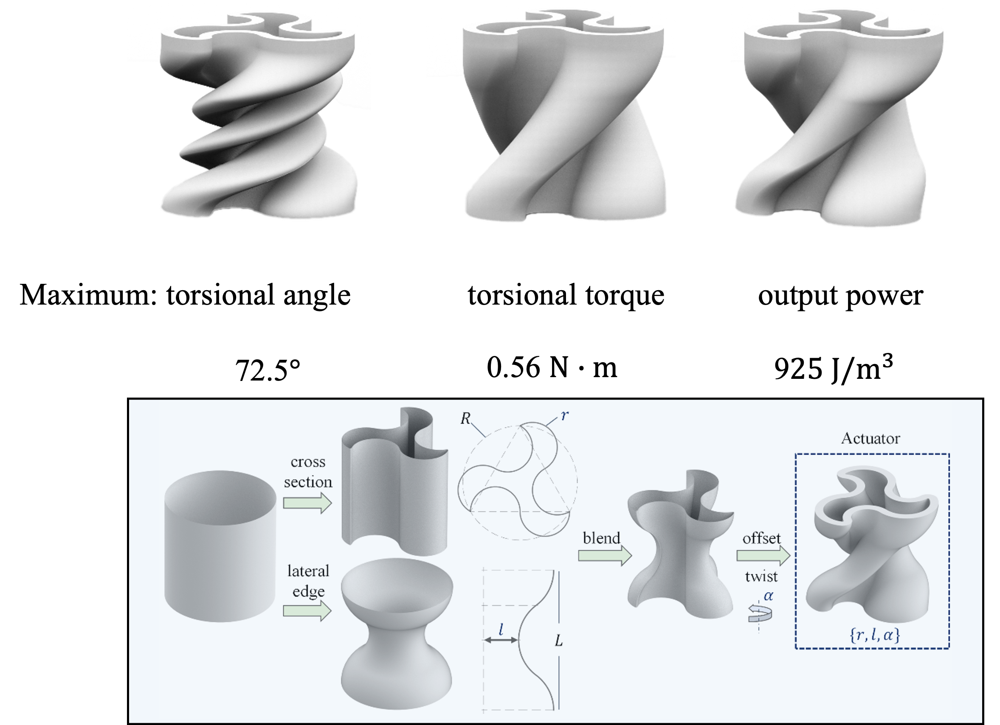
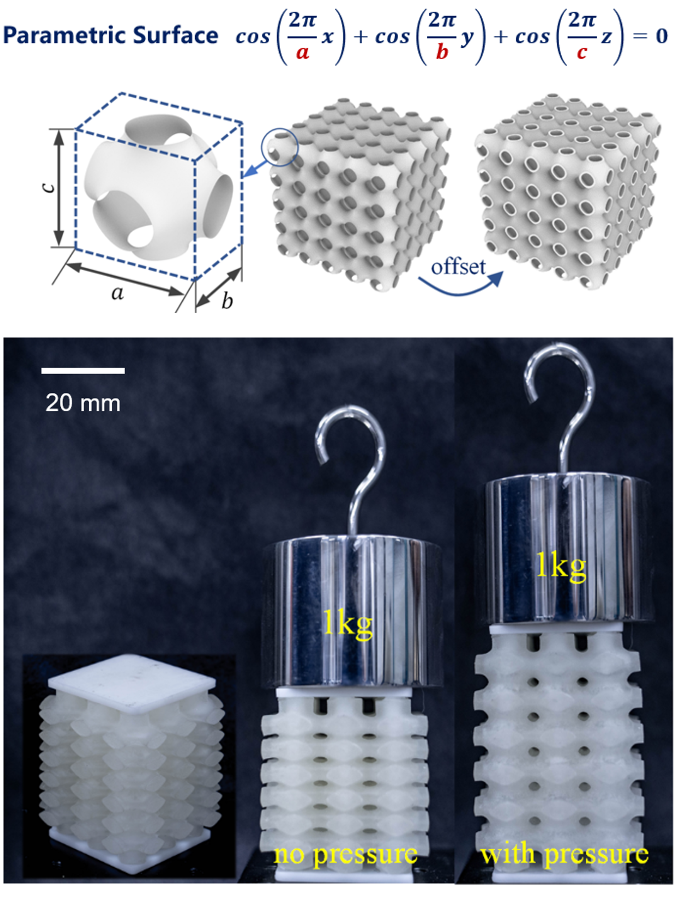
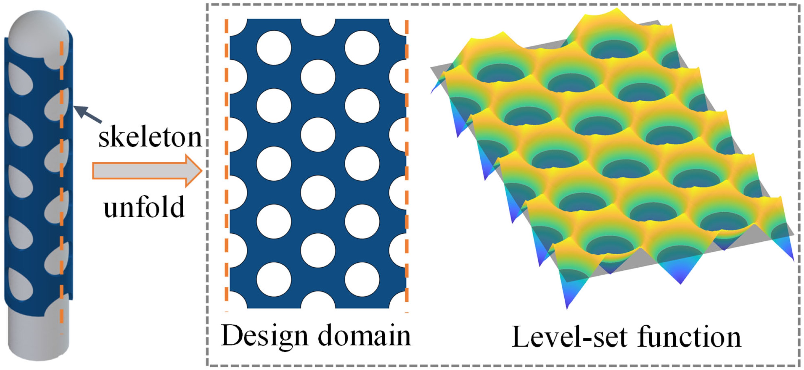
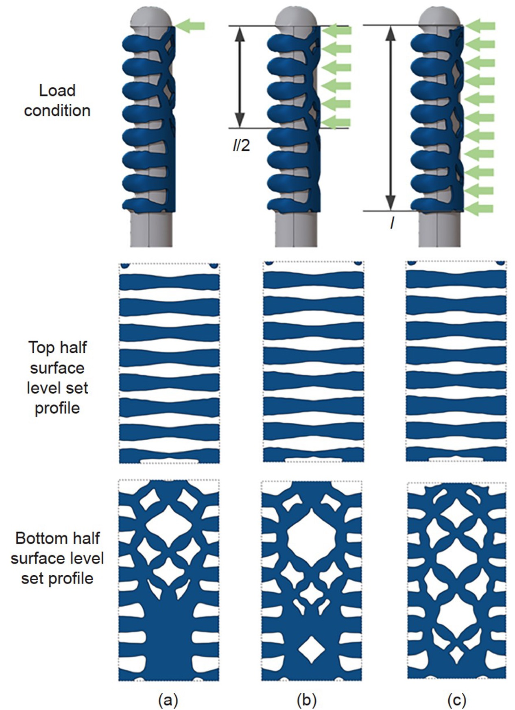
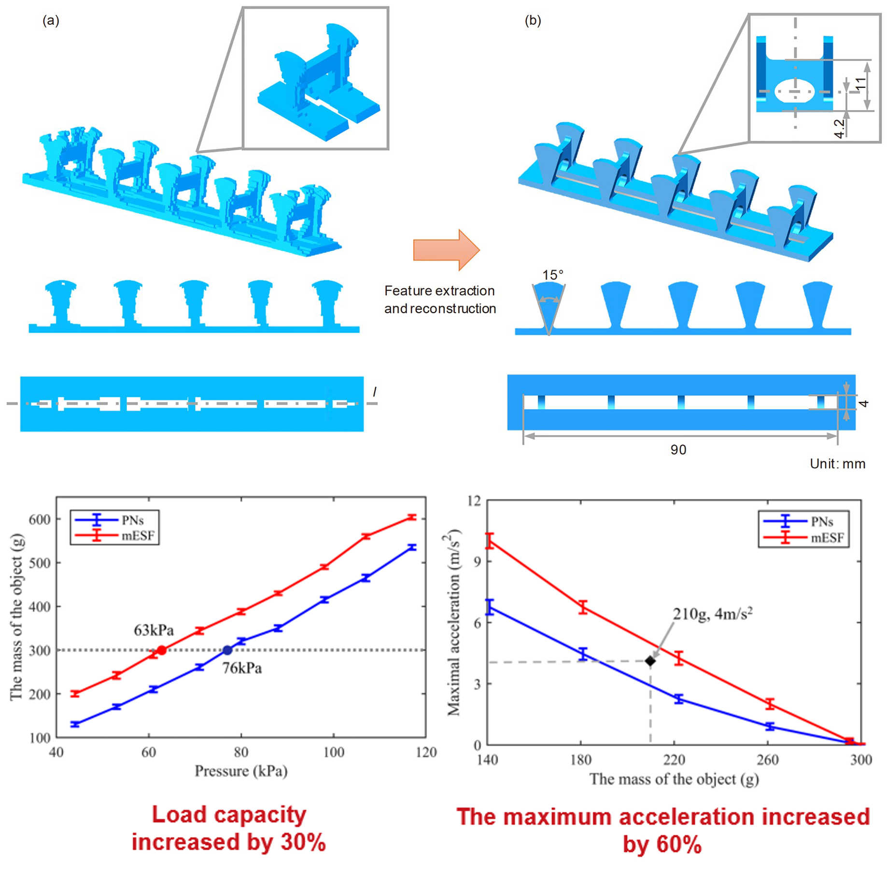
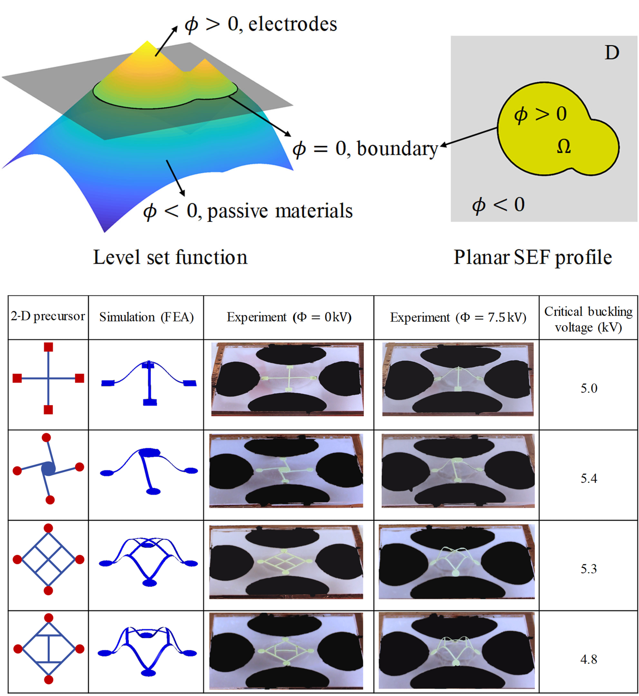
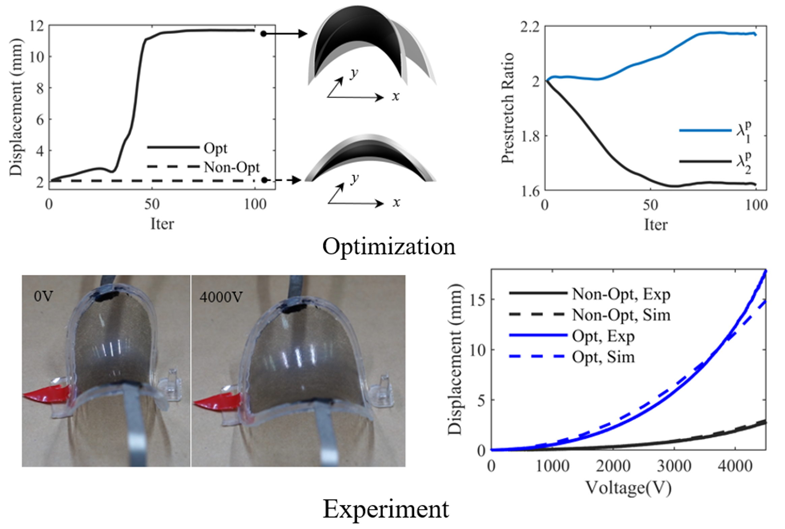
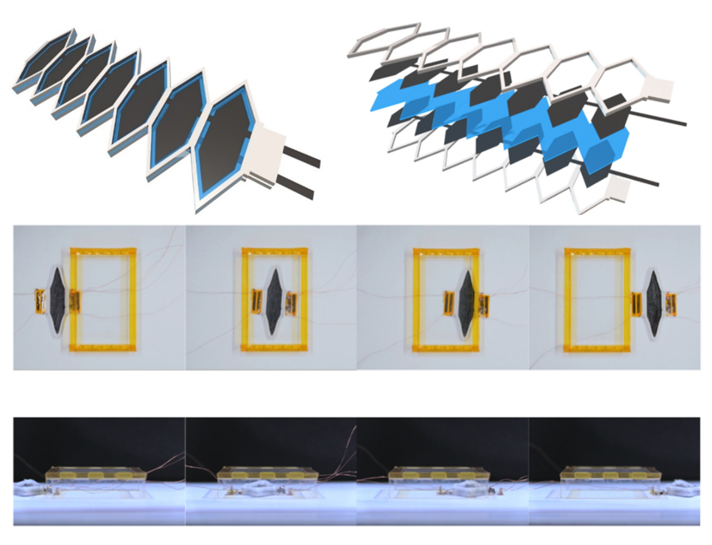

#  NEWS







#  Research

We are dedicated to exploring optimization methods, such as topological optimization, in the following three directions:

## 1. Aerodynamic shape design of soft robots.

    

      
    

    

        <h2>Geometry Design, Optimization and Characterization of Soft Pneumatic Twisting Actuators</h2>
        
The aerodynamic shape design that breaks the current geometric constraints introduces parameterized freeform surfaces and integrates large deformation analysis with optimization algorithms, achieving pure torsional motion in a single material structure. Moreover, the output deformation and output torque significantly outperform existing designs.

    



    

      
    

    

        <h2>Triply Periodic Channels Enable Soft Pneumatic Linear Actuator with Single Material and Scalability.</h2>
        
We present a new design for soft pneumatic actuators based on triple periodic minimal surface(TPMS), which realizes the controllable directional deformation of a single material structure. Through the single material geometric design, the cumbersome process of fiber-winding actuators is avoided, and the lack of periodicity and difficulty in scaling of traditional bellow actuators. The actuator has the advantages of easy programming and high energy density.

    



## 2. Multi-material distribution design and control of anisotropic stiffness in soft robots.

    

      
    

    

        <h2>Topology Optimization of Skeleton-reinforced Soft Pneumatic Actuators for Desired Motions.</h2>
        
We present a design paradigm for soft pneumatic multi-material actuators by incorporating a stiffer material layer as a skeleton to softer inflated rubber. A topology optimization-based framework is used to automatically generate the skeleton layout, enabling desired motions like bending or twisting. Our approach considers geometric and material nonlinearities, achieving high-performance bending (73°) and twisting (143°) actuators. The design methodology offers a rigorous and efficient solution for generating material layouts that deliver spatially varying deformation upon actuation.

    



    

      
    

    

        <h2>Enhancing Interaction Performance of Soft Pneumatic-networks Grippers by Skeleton Topology Optimization.</h2>
        
We propose a computational design framework for soft grippers with a focus on improving their interaction performance in power grasping or precision grasping mode. The optimized skeleton layouts exhibit specified structural features high relevant to the predefined concentrated loads for precision grip or distributed loads for power grip, which physically implies the compromise between deformability and stiffness. This work represents an initial step toward the rational design for interaction in soft robots.

    



    

      
    

    

        <h2>Tailoring the In-plane and Out-of-plane stiffness of Soft Fingers by Endoskeleton Topology Optimization for Stable Grasping.</h2>
        
We design a new type of soft finger by embedding an endoskeleton inside the widely-used PneuNets actuator, and the endoskeleton layout is optimized to achieve a remarkable bending deflection and limited lateral deflection under combined external in-plane and out-of-plane loads. Based on the multi-objective topology optimization approach, the key structural features of the optimized endoskeleton are extracted and parameterized. Static and dynamic experiment results validate that the soft gripper with endoskeleton embedded exhibits remarkably improved out-of-plane stiffness, without sacrificing the in-plane bending flexibility, and leads to more stable grasping.

    



## 3. Integrated design of actuation and structure in dielectric-driven soft robots.

    

      
    

    

        <h2>Automatic Design of Soft Dielectric Elastomer Actuators With Optimal Spatial Electric Fields.</h2>
        
We propose a dynamic level set method to describe and track continuously changing spatial electric fields, develop an integrated design theory of actuation-material-structure based on shape derivatives and level-sets, and develop a numerical calculation algorithm for level-set  topology optimization. 

    



    

      
    

    

        <h2>Optimal biaxial prestretch ratios of soft dielectric elastomer actuators for maximal voltage-induced displacement.</h2>
        
We have proposed a method for dual-axis pre-stretching optimization design of dielectric elastomer actuators, which enables precise prediction of optimal pre-stretching through theoretical implementation. This method is applicable to both planar and three-dimensional minimum energy structure-type actuators. 

    



    

      
    

    

        <h2>An Integrated Design and Fabrication Strategy for Planar Soft Dielectric Elastomer Actuators.</h2>
        
We propose an active functional material combined with a passive grid structure in a layered stacking design configuration, achieving 40% actuation strain. By incorporating electrostatic adhesion, we have developed a prototype of a sheet-type crawling robot, enabling fast and controllable motion in narrow spaces. 

    

